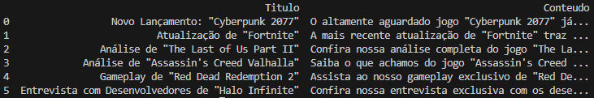
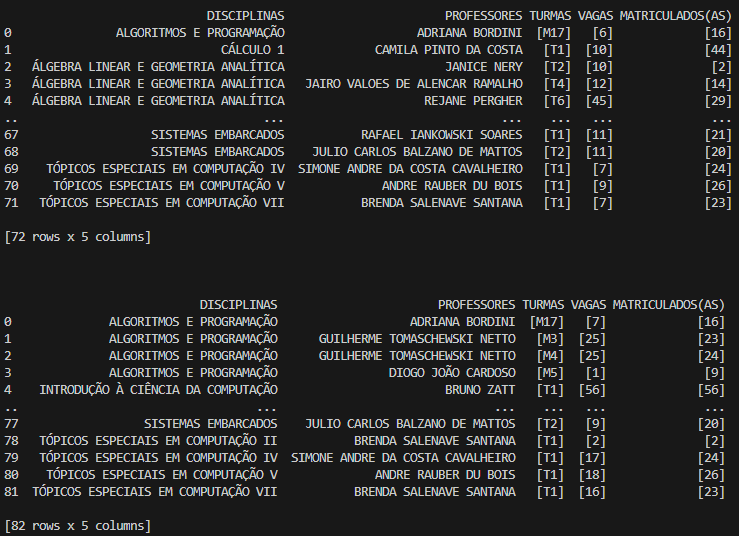
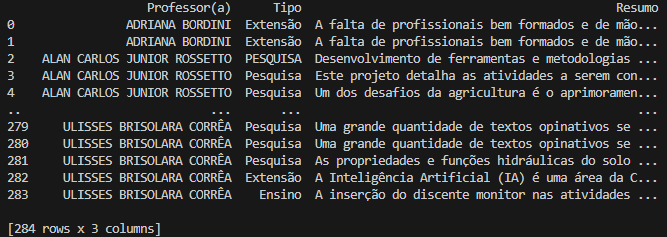

# Exercício 1

```python
from bs4 import BeautifulSoup
import pandas as pd

# carrega o arquivo 
with open('exemplo.html', 'r', encoding='utf-8') as file:
    documento = BeautifulSoup(file, 'html.parser')
                                            
articles = documento.find_all('article')

# extrai os dados
dados = []
for article in articles:
    if article.find('h3'):
        titulo = article.find('h3').get_text(strip=True)
    else:
        titulo = None

    if article.find('p'):
        conteudo = article.find('p').get_text(strip=True)
    else:
        conteudo = None
    
    dados.append({'Titulo': titulo, 'Conteudo': conteudo})


df = pd.DataFrame(dados)
print(df)
```
## Exemplo de saída


# Exercício 2

```python
from bs4 import BeautifulSoup
import pandas as pd
import requests


def extrair_dados(url):

    # retorna o conteudo da pagina
    conteudoDaPagina = requests.get(url)

    # torna o conteudo da pagina em um tipo BS
    pagina = BeautifulSoup(conteudoDaPagina.text, 'html.parser')

    # listas para salvar os dados
    lista_disciplinas = []
    lista_professores = []
    lista_turmas = []
    lista_vagas = []
    lista_alunos_matriculados = []

    print('\n\n')
    curriculo_versao_atual = pagina.find('div', class_='versao atual')
    num_semestres =  len(curriculo_versao_atual.find_all('table', class_='tabela-dados cor-borda'))

    for semestre in range(0, num_semestres):
        tabela_dados_atual = curriculo_versao_atual.find_all('table', class_='tabela-dados cor-borda')[semestre]
        total_tr = len(tabela_dados_atual.find_all('tr'))

        for tr_atual in range(1, total_tr, 3):
            disciplina_atual = tabela_dados_atual.find_all('tr')[tr_atual]

            # pega o nome da disciplina
            codigo_e_nome_disciplina = disciplina_atual.find('a')
            nome_disciplina = str(codigo_e_nome_disciplina).split('-')[-1].split('<')[0]          # pega o nome da disciplina
            nome_disciplina = nome_disciplina[1:]                                                 # remove o espaço extra do inicio da string
            lista_disciplinas.append(nome_disciplina)

            # pega o nome do professor
            nome_professor = disciplina_atual.find('span', class_='tabela-detalhe-info')
            nome_professor = str(nome_professor).split(':')[-1].split('<')[0]
            nome_professor = nome_professor[1:]
            lista_professores.append(nome_professor)

            # pega a turma"
            turma = disciplina_atual.find_all('td')[-3]
            lista_turmas.append(turma)

            # pega as vagas
            vagas = disciplina_atual.find_all('td')[-2]
            lista_vagas.append(vagas)

            # pega o numero de alunos matriculados
            num_alunos_matriculados = disciplina_atual.find_all('td')[-1]
            lista_alunos_matriculados.append(num_alunos_matriculados)
        
        
    # organizaçao dos dados
    dados = pd.DataFrame({ 'DISCIPLINAS': lista_disciplinas, 'PROFESSORES': lista_professores, 'TURMAS': lista_turmas, 'VAGAS': lista_vagas,'MATRICULADOS(AS)': lista_alunos_matriculados})
    print(dados)
    dados.to_csv('eng_comp.xls', index=False)


url_eng_comp = 'https://institucional.ufpel.edu.br/cursos/cod/3910'
extrair_dados(url_eng_comp)

url_ciencia_comp = 'https://institucional.ufpel.edu.br/cursos/cod/3900'
extrair_dados(url_ciencia_comp)

url_biotecnologia = 'https://institucional.ufpel.edu.br/cursos/cod/5700'
extrair_dados(url_biotecnologia)

url_eng_materiais = 'https://institucional.ufpel.edu.br/cursos/cod/6100'
extrair_dados(url_eng_materiais)

url_eng_hidrica = 'https://institucional.ufpel.edu.br/cursos/cod/6400'
extrair_dados(url_eng_hidrica)
```
## Exemplo de saída


# Exercício 3

```python
from bs4 import BeautifulSoup
import pandas as pd
import requests


def extrair_dados(url, numero_professores):
    
    # retorna o conteudo da pagina
    pagina_curso = requests.get(url)
    pagina_principal_soup = BeautifulSoup(pagina_curso.text, 'html.parser')

    # listas para armazenar dados
    lista_professores_cdted = []
    lista_tipo_projeto = []
    lista_resumo_projeto = []

    div_professores = pagina_principal_soup.find('div', id="professores")
    base_link = 'https://institucional.ufpel.edu.br'

    for professor in range(0, numero_professores):

        # pega o href dos professores
        cdtec = div_professores.find_all('span', string='Centro de Desenvolvimento Tecnológico')[professor]
        nome_professor = cdtec.parent
        href_link = nome_professor.get('href')

        # pega os nomes dos professores que sao do cdtec
        nome_professor = str(nome_professor.find('span')).split('>')[-2].split('<')[0]
        lista_professores_cdted.append(nome_professor)

        # acessa o link do professor atual
        link_professor = base_link + href_link + '#projetos'
        pagina_professor = requests.get(link_professor)
        pagina_professor_soup = BeautifulSoup(pagina_professor.text, 'html.parser')

        # acessa a aba de projetos
        div_projetos = pagina_professor_soup.find('div', id="projetos")

        # pega cada <tr> que contem link para um projeto
        trs_com_links = []
        if div_projetos:
            trs = div_projetos.find_all('tr') 
            for tr in trs:
                if tr.find('a'): 
                    trs_com_links.append(tr)
                    lista_professores_cdted.append(nome_professor)
            lista_professores_cdted.pop()

        for tr in trs_com_links:
        
            # pega o link de cada <tr>
            href_link_projeto = tr.find('a')['href']  
            link_projeto = base_link + href_link_projeto 

            # acessa o projeto atual
            pagina_projeto = requests.get(link_projeto) 
            pagina_projeto_soup = BeautifulSoup(pagina_projeto.text, 'html.parser')
            
            # pega o tipo de projeto
            tipo_projeto = pagina_projeto_soup.find('div', class_='ficha-campo caps').get_text()
            lista_tipo_projeto.append(tipo_projeto)

            # pega o resumo do projeto
            div_ficha = pagina_projeto_soup.find('div', class_='ficha-dados cor-borda')
            resumo_projeto = div_ficha.find_all('div')[-1].get_text()
            lista_resumo_projeto.append(resumo_projeto)

    
    # organizaçao dos dados
    dados = pd.DataFrame({ 'Professor(a)': lista_professores_cdted, 'Tipo': lista_tipo_projeto, 'Resumo': lista_resumo_projeto})
    print(dados)
    dados.to_csv('eng_comp.xls', index=False)


url_eng_comp = 'https://institucional.ufpel.edu.br/cursos/cod/3910#professores'
extrair_dados(url_eng_comp, 34)

# sem necessidade de rodar ja que sao os mesmos professores ( mas funciona ;) )
#url_ciencia_comp = 'https://institucional.ufpel.edu.br/cursos/cod/3900#professores'
#extrair_dados(url_ciencia_comp, 34)
```

## Exemplo de saída

